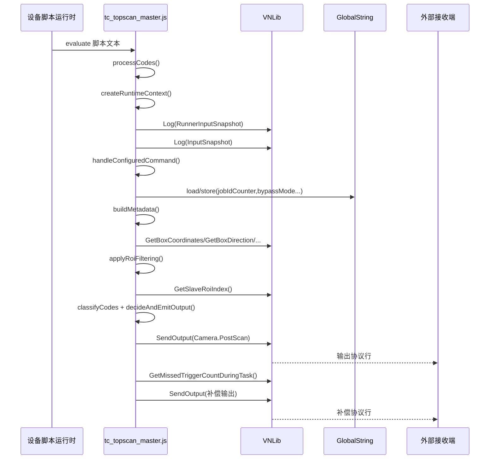

# TC 脚本模块执行时序流程

## 1. 文档目的

本文说明当前有效顶扫脚本 `tc_topscan_master.js` 在下位机中的执行时序，重点回答以下问题：

- 设备运行时如何向脚本注入数据。
- 顶扫脚本如何记录首行输入快照。
- 顶扫脚本如何处理命令、metadata、ROI、分类、历史和输出。
- 顶扫脚本如何通过 `VNLib.SendOutput()` 输出 `Camera.PostScan`。

本文基于更新后的 `tc_topscan_master.js` 整理。侧扫脚本当前按用户要求先忽略，只把 `VNLib.GetSlaveRoiIndex()` 作为顶扫可选输入背景。

## 2. 脚本文件分工

当前维护重点：

- `tc_topscan_master.js`：当前有效顶扫输出脚本，用于输入快照日志、命令处理、metadata、ROI 过滤、条码分类、历史去重、输出决策和漏触发补偿。
- `tc_topscan_node.js`：如果现场仍要求两个顶扫脚本一致，可按 `tc_topscan_master.js` 同步；本时序文档不重复展开。
- `tc_in_front_0401.js`、`tc_out_front_0401.js`：侧扫脚本，当前先忽略。

可以按职责理解为：

- 顶扫脚本：负责把识别结果转换为客户协议输出。
- 侧扫状态：如果仍由系统提供，顶扫脚本可读取并用于 ROI 过滤；如果不可用，顶扫跳过 ROI 过滤。

## 3. 关键运行组件

脚本执行主要涉及以下运行组件：

- 上位机脚本配置：保存脚本文本和变量映射关系。
- 设备脚本运行时：执行 JavaScript，并提供 `VNLib`、`GlobalString`、`GlobalNumeric` 等接口。
- 识别结果处理流程：把条码、ROI、时间、设备号等数据注入到顶扫脚本。
- 顶扫脚本执行流程：执行 `processCodes()` 并按 Context 流水线处理当前任务。
- 可选 ROI 状态读取流程：如果系统提供侧扫 ROI map，顶扫通过 `VNLib.GetSlaveRoiIndex()` 读取；如果没有则跳过 ROI 过滤。

文档只描述客户脚本可感知的运行阶段，不展开内部源码文件和函数实现。

## 4. 脚本引擎与全局对象

设备使用内置脚本运行时执行 JavaScript。

### 4.1 顶扫输出脚本引擎

顶扫输出脚本在每次任务结果处理阶段执行。

执行前设备会注入：

- `VNLib`：脚本调用下位机能力的入口。
- `GlobalString`：跨任务保存字符串状态。
- `GlobalNumeric`：跨任务保存数字状态。
- `strStored`：串口接收到的脚本命令。
- `strTcpStored`：TCP 接收到的脚本命令。
- 格式配置里映射出来的业务变量，例如 `code`、`center`、`ROI_number`、`time`。

顶扫脚本每次执行都是对脚本文本整体 `evaluate()`，脚本末尾会主动调用 `processCodes()`。

### 4.2 侧扫脚本当前状态

本轮文档先忽略侧扫脚本。更新后的顶扫 `tc_topscan_master.js` 不再定义或调用 `SetRoiIndex/RegisterCallback`。

顶扫脚本只会在 ROI 过滤阶段调用 `VNLib.GetSlaveRoiIndex()` 读取可选 ROI map。该返回值为空、不可解析或没有内容时，顶扫脚本会跳过 ROI 过滤。

## 5. 完整时序总览

当前顶扫主链路可以分为 8 个阶段：

1. 任务初始化，设备准备本次识别结果和脚本变量。
2. 顶扫参数注入，形成 `code/center/ROI_number/time` 等 JS 全局变量。
3. 顶扫脚本执行并创建 RuntimeContext。
4. 先输出 `RunnerInputSnapshot`，再输出 `InputSnapshot`，记录所有关键输入信息。
5. 处理串口/TCP 命令并生成 metadata。
6. 可选执行 ROI 过滤，然后拆分条码、读取历史、分类、计算 `DisposalMark`。
7. 按输出决策 handler 顺序选择 `Camera.PostScan` 内容。
8. 通过 `VNLib.SendOutput()` 输出，并按漏触发数量追加补偿行。

下面按执行顺序展开。

### 5.1 顶扫执行时序图



## 6. 阶段一：任务初始化

新任务开始前，设备任务流程会清理上一任务遗留状态，包括：

- 包裹坐标信息。
- 包裹虚拟线信息。
- 当前任务 ROI index。
- 组网收到结果的从机列表。
- 组网从机 ROI map。
- 当前任务漏触发计数缓存。

关键效果是：

- 当前任务的条码、包裹、漏触发等状态应来自本次触发。
- 如果系统仍提供 ROI map，顶扫脚本本次读取到的 ROI 状态不应混入上一任务结果。
- 当前现场若不使用 ROI map，顶扫脚本会在 ROI 读取失败或为空时跳过过滤。

这一阶段非常重要，因为顶扫脚本后续会基于本次注入变量生成 `RunnerInputSnapshot`、`InputSnapshot` 和输出结果。

## 7. 阶段二：顶扫脚本参数注入

主机汇总完识别结果后，如果脚本功能开启，会进入顶扫脚本执行流程。

设备会根据脚本参数配置生成 JS 全局变量。当前顶扫脚本关键变量包括：

- `code`：当前任务所有码内容，用 `VNLib.getSeparator()` 分隔。
- `center`：各码中心点，顺序与 `code` 对齐。
- `ROI_number`：各码所属 ROI 编号，顺序与 `code` 对齐。
- `time`：当前同步时间。
- `device_number`：条码所属设备编号。
- `strStored`：串口命令。
- `strTcpStored`：TCP 命令。
- `box_angle`：包裹角度。
- `box_coordinate`：包裹坐标。

如果系统仍提供侧扫 ROI map，顶扫脚本可通过 `VNLib.GetSlaveRoiIndex()` 读取。当前文档不展开侧扫 map 的生成过程。

## 8. 阶段三：顶扫脚本创建 Context 并输出输入快照

顶扫脚本执行后会进入：

```js
try {
    processCodes();
} catch (error) {
    logDebug("Processing error: " + error.message);
}
```

`processCodes()` 的第一步是创建 RuntimeContext，随后先调用 `logRunnerStyleInputSnapshot(context)`，再调用 `logInitialInputSnapshot(context)`。

关键输入日志格式类似：

```text
RunnerInputSnapshot:
{
  "timeoutMs": 5000,
  "injected": { ... },
  "vnlib": { ... },
  "globalStringStore": {},
  "globalNumericStore": {}
}

InputSnapshot | version=... | code=... | center=... | ROI_number=... | time=... | strStored=... | strTcpStored=... | box_coordinate=... | device_number=... | box_angle=... | is_box_pass_line=...
```

这条日志用于确认上位机变量映射、识别结果注入、命令输入和包裹相关数据是否正确。

## 9. 阶段四：命令、metadata 和输入校验

顶扫脚本随后按顺序执行：

1. `handleConfiguredCommand(context)`：处理串口/TCP 命令，优先级为 `strStored > strTcpStored`。
2. `buildMetadata(context)`：生成 `Metadata.Skewness`、`Metadata.Time`、`Metadata.Distance`、`Metadata.Camera.Status`、`Metadata.Box`、`Metadata.boxlength` 等字段。
3. `validateRuntimeInput(context)`：校验 `code` 和 `center` 是否存在且为字符串。

如果 `code/center` 缺失，脚本会按无码场景输出 `????`，避免因变量映射缺失导致脚本中断。

## 10. 阶段五：ROI、历史和分类

输入校验通过后，顶扫脚本继续执行：

1. `checkAndClearTimeoutHistory()`：清理超时历史。
2. `applyRoiFiltering(context)`：如果 `VNLib.GetSlaveRoiIndex()` 有效，则按 `Tall/Short` 过滤 `code/center`。
3. `splitFilteredCodes(context)`：拆分过滤后的码和中心点。
4. `loadPreviousOutput(context)`：读取历史主码。
5. `classifyCodes(context)`：分类为 Maxicode、1Z、PostalCode、特殊一维码。
6. `calculateDisposalMarkForContext(context)`：历史过滤后计算 `DisposalMark`。
7. `buildCodePositions(context)`：建立条码和中心点坐标映射。

如果 ROI 不可用，脚本会跳过过滤并继续使用原始顶扫条码。

## 11. 阶段六：输出决策和发送

最终由 `decideAndEmitOutput(context)` 按业务优先级调度输出 handler：

1. `handleSpecialOneDOutput()`：特殊一维码优先。
2. `handleIncompleteOutput()`：处理不完整结果。
3. 多包裹/同类多码冲突：输出 `!!!!`。
4. `handleContainedPairOutput()`：处理当前任务内 1Z 与 Maxicode 的包含匹配。
5. `handleClosestMainCodeOutput()`：选择距离原点最近的未输出主码。
6. `handlePostalFallbackOutput()`：PostalCode 兜底。
7. 最终无码兜底：输出 `????`。

所有正式输出最终通过 `emitPostScan()` 和 `sendOutput()` 进入 `VNLib.SendOutput()`，漏触发补偿也在 `sendOutput()` 后统一追加。

## 12. 顶扫入口补充说明

顶扫脚本文件末尾只保留：

```js
try {
    processCodes();
} catch (error) {
    logDebug("Processing error: " + error.message);
}
```

当前 `tc_topscan_master.js` 不应再出现 `SetRoiIndex()`、`RegisterCallback()` 或主动 `RegisterCallback();`。如果出现这些函数，说明使用的不是当前重构后的顶扫版本。

`ROI_number` 仍按一基 ROI 编号理解：

```text
ROINo + 1 + roioffse
```

因此顶扫过滤规则保持为：

- `Tall` -> `ROI_number = 2`
- `Short` -> `ROI_number = 1`

## 15. 顶扫 ROI 过滤逻辑

顶扫脚本中 ROI 相关核心函数是：

- `judgeRoiMode()`
- `filterCodesByRoi(codeStr, centerStr, roiNumberStr)`

`judgeRoiMode()` 会调用：

```js
VNLib.GetSlaveRoiIndex()
```

然后解析从机 ROI map。

当前逻辑是：

```text
只要任一从机 ROI 值为 1，则认为当前包裹是 Tall。
否则认为当前包裹是 Short。
```

随后 `filterCodesByRoi()` 映射为顶扫脚本中的目标 ROI 编号：

- `Tall` -> `ROI_number = 2`
- `Short` -> `ROI_number = 1`

然后遍历 `code`、`center`、`ROI_number` 三组并行数据，只保留目标 ROI 中的码。

特殊情况：

- 如果 `VNLib.GetSlaveRoiIndex()` 无法解析或为空，则不做 ROI 过滤。
- 如果过滤后没有任何条码匹配目标 ROI，则把条码内容替换为 `????`，其余识别数据保持原值。

## 16. 条码分类与业务决策

顶扫脚本按内容把条码分为：

- `1Z`：以 `1Z` 开头。
- Maxicode：以 `[)` 开头。
- PostalCode：长度为 8。
- 特殊一维码：以 `B` 或 `1B` 开头。

`DisposalMark` 判定逻辑：

- `0`：正常结果。
- `1`：不完整或无主码。
- `2`：多包裹或同类多码冲突。
- `3`：特殊一维码相关结果。

当前更新后的多包裹判断重点是：

- 历史去重后，`1Z + 特殊一维码` 总数大于 1，也算多包裹。
- Maxicode 数量大于 1，也算多包裹。
- 多包裹输出时主字段使用 `!!!!`。

## 17. 历史去重与超时

顶扫脚本通过 `GlobalString` 保存跨任务状态：

- `lastTaskCodes`：最近输出过的主码记录。
- `codeTimes`：主码首次记录时间。
- `jobIdCounter`：任务流水号。
- `bypassMode`：bypass 模式状态。

历史清理逻辑：

- 每次 `processCodes()` 前会调用超时清理。
- 默认超时时间为 10 秒。
- 超时后从 `lastTaskCodes` 和 `codeTimes` 中移除。

业务意义：

- 避免同一包裹多次触发时重复输出。
- 超过 10 秒后允许同一个码再次输出。

## 18. 输出格式

最终输出格式为：

```text
Camera.PostScan	JobId	1Z或特殊一维码	Maxicode	PostalCode	DisposalMark	0	Metadata...
```

字段间使用制表符 `\t`，行尾使用 `\r\n`。

Metadata 当前主要包括：

- `Metadata.Skewness`：包裹偏斜角。
- `Metadata.Time`：任务时间。
- `Metadata.Distance`：包裹是否过线或压线。
- `Metadata.Camera.Status`：在线相机数量。
- `Metadata.Box`：`Tall` 或 `Short`。
- `Metadata.boxlength`：包裹边长。

## 19. 漏触发补偿

顶扫脚本输出正常 `Camera.PostScan` 后，会调用：

```js
VNLib.GetMissedTriggerCountDuringTask()
```

如果返回值大于 0，则追加补偿输出。

补偿输出特点：

- 每个漏触发补一行。
- 每行消耗一个新的 `JobId`。
- 主码字段通常为 `????`。
- Metadata 使用占位或当前可用信息。

业务意义是保证外部系统收到的输出行数尽量与硬件触发包裹数一致。

## 20. 外部命令处理

顶扫脚本支持从串口或 TCP 接收命令。

命令来源优先级：

1. `strStored`
2. `strTcpStored`

支持命令：

- `bypass on`：开启 bypass。
- `bypass off`：关闭 bypass。
- `resetnum`：重置 JobId 计数。

当前 `更新要点.md` 中提到 `resetno`，但脚本实际识别的是 `resetnum`。现场配置和上位机命令需要以实际脚本为准，或同步修改脚本命令。

## 21. 数据流总结

完整数据链路如下：

```text
顶扫识别结果
  -> 上位机变量映射
  -> 下位机注入 code / center / ROI_number / time / command
  -> tc_topscan_master.js createRuntimeContext
  -> RunnerInputSnapshot + InputSnapshot 首行日志
  -> 命令处理 / metadata
  -> 可选 GetSlaveRoiIndex ROI 过滤
  -> 分类 / 历史 / DisposalMark / 坐标映射
  -> decideAndEmitOutput 输出决策 handler
  -> VNLib.SendOutput
  -> 漏触发补偿输出
  -> 外部收到 Camera.PostScan
```

## 22. 时序细节表

| 阶段 | 执行位置 | 关键动作 | 主要数据 |
| --- | --- | --- | --- |
| 任务初始化 | 设备任务流程 | 清空上次任务状态 | 包裹、ROI、漏触发状态 |
| 识别执行 | 设备识别流程 | 运行识别并生成结果 | 条码结果、包裹结果 |
| 准备脚本数据 | 设备脚本运行时 | 注入上位机映射变量 | `code`、`center`、`ROI_number`、`time` |
| 创建上下文 | 顶扫脚本 | `createRuntimeContext()` | 输入变量、设备状态、中间结果容器 |
| 输入快照 | 顶扫脚本 | `logRunnerStyleInputSnapshot()` + `logInitialInputSnapshot()` | `RunnerInputSnapshot` + `InputSnapshot` |
| 命令与 metadata | 顶扫脚本 | 处理命令、生成 metadata | `strStored`、`strTcpStored`、包裹信息 |
| ROI/分类/历史 | 顶扫脚本 | 过滤、拆分、分类、历史去重 | 条码数组、历史主码、`DisposalMark` |
| 输出决策 | 顶扫脚本 | `decideAndEmitOutput()` | handler 决策结果 |
| 顶扫输出 | `tc_topscan_master.js` | `emitPostScan()`、`VNLib.SendOutput()` | `Camera.PostScan` |
| 漏触发补偿 | 顶扫脚本 | `buildMissedTriggerCompensationOutput()` | 补偿 `Camera.PostScan` |

## 23. 需要重点关注的问题

### 23.1 顶扫首行输入快照

当前顶扫脚本前两条关键日志应为 `RunnerInputSnapshot` 与 `InputSnapshot`。如果没有看到，优先确认是否已粘贴更新后的 `tc_topscan_master.js`。

### 23.2 ROI 编号存在 0 基和 1 基转换

顶扫脚本读取到的 `ROI_number` 是一基编号。

顶扫脚本的 `ROI_number` 来自：

```text
ROINo + 1 + roioffse
```

因此顶扫过滤使用 1 基：

- ROI index 0 -> `ROI_number = 1`
- ROI index 1 -> `ROI_number = 2`

这也是顶扫脚本过滤时 `Tall` 对应 `ROI_number = 2`、`Short` 对应 `ROI_number = 1` 的原因。

### 23.3 无 ROI 匹配时输出占位条码

`filterCodesByRoi()` 如果在有效 ROI 模式下没有匹配到目标 ROI 条码，会返回空 `code/center`，后续进入无码输出分支。

这是一种兜底策略，避免不符合 ROI 条件的原始码继续输出。排查时要看日志：

```text
ROI filter - no code matched target ROI, return empty to trigger no-barcode flow
```

### 23.4 bypass 初始化逻辑

顶扫脚本应使用：

```js
let bypassMode = GlobalString.load("bypassMode") === "true";
```

这样 `bypass on` 写入 `"true"` 后会进入 bypass，`bypass off` 写入 `"false"` 后会恢复普通模式。

### 23.5 `resetnum` 与 `resetno` 名称不一致

更新说明中写的是 `resetno`，但当前脚本判断的是 `resetnum`。

如果 TCP 或串口发送 `resetno`，当前脚本不会重置 JobId。

### 23.6 输出决策顺序

`decideAndEmitOutput()` 的 handler 顺序代表业务优先级。新增规则时必须明确插入位置，避免影响特殊一维码、多包裹、包含关系和兜底输出。

## 24. 排查建议

现场排查建议按以下顺序：

1. 查看前两条关键日志是否为 `RunnerInputSnapshot` 与 `InputSnapshot`，确认 `code/center/ROI_number/time` 等输入值正确。
2. 验证 `bypass on/off` 和 `resetnum` 命令是否生效。
3. 验证最终 `Camera.PostScan` 字段顺序和客户协议是否一致。
4. 验证特殊一维码优先输出和 `DisposalMark=3`。
5. 验证单 1Z、单 Maxicode、只有 PostalCode、无码等不完整场景。
6. 验证多包裹场景是否输出 `!!!!` 且 `DisposalMark=2`。
7. 验证 1Z 与 Maxicode 包含关系能组合输出。
8. 验证没有完整组合时是否选择距离坐标原点最近的未输出主码。
9. 验证 10 秒后历史条码是否能重新输出。
10. 验证漏触发场景下是否追加补偿行。
11. 如果现场仍使用 ROI，查看 `ROI filter - roiMode`、目标 ROI index 和过滤后条码数量；如果不使用 ROI，确认 ROI 不可用时脚本仍正常输出。

## 25. 总结

当前 `tc_topscan_master.js` 不是单纯的字符串格式化脚本，而是承担了完整顶扫输出决策：

- 使用 RuntimeContext 组织单次任务数据。
- 首先输出 `RunnerInputSnapshot`，再输出 `InputSnapshot`，方便现场排查变量注入。
- 可选读取 ROI 状态并过滤条码。
- 负责条码分类、历史去重、多包裹判断、Maxicode 特殊一维码解析、漏触发补偿和最终输出。
- 通过多个输出决策 handler 保持业务优先级清晰。

最终目标是让顶扫脚本在复杂识别场景下输出符合客户协议的 `Camera.PostScan` 结果。
