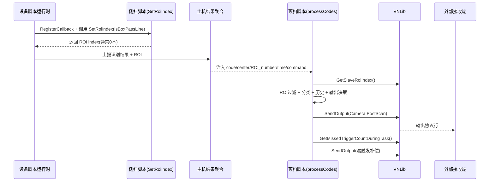
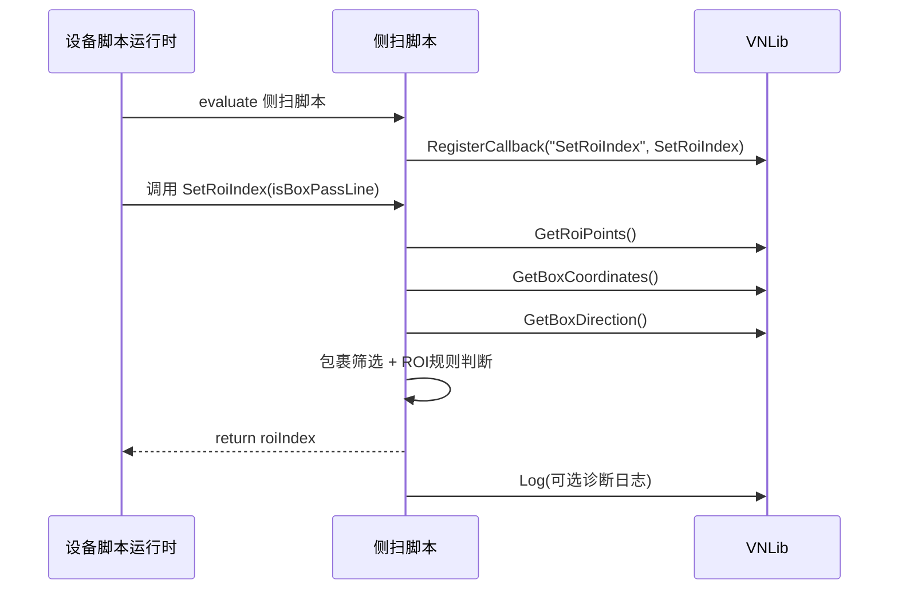
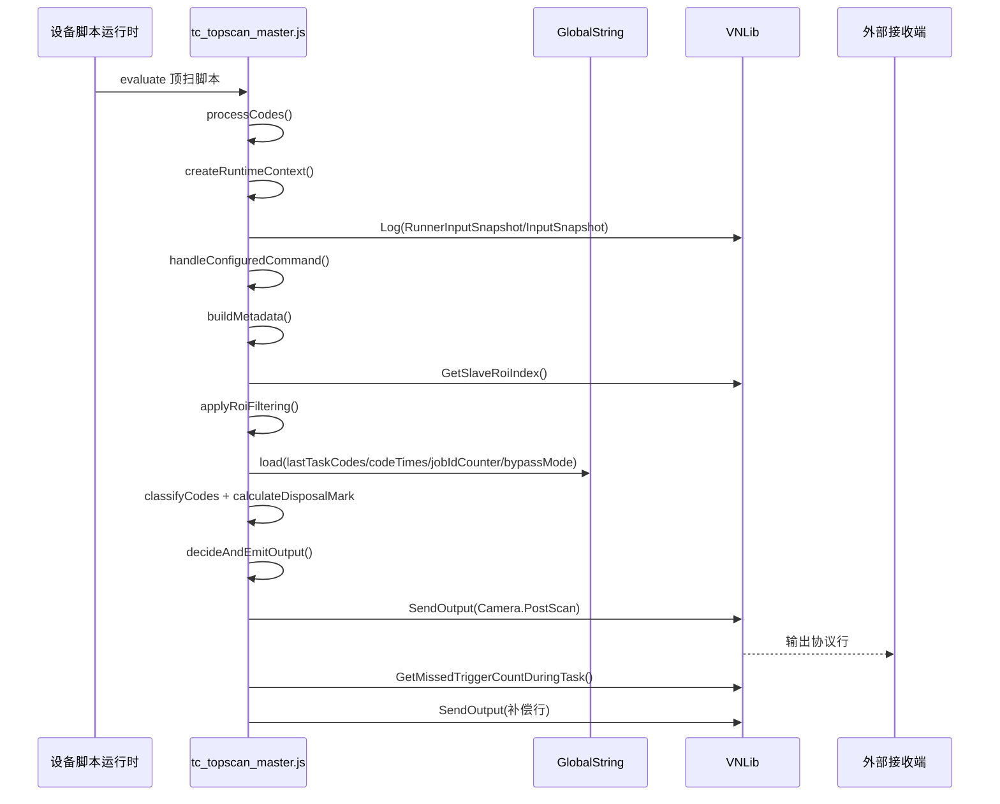

# 顶扫与侧扫脚本运行时序与时序图

## 1. 文档目的

本文补充说明当前 TC 项目中：

- 侧扫脚本（前置 ROI 决策）内部运行时序；
- 顶扫脚本（输出决策）内部运行时序；
- 两者在一次触发任务中的先后关系与数据衔接。

适用范围：以现有脚本形态为准（顶扫主脚本 `tc_topscan_master.js`，侧扫脚本 `tc_in_front_0401.js` / `tc_out_front_0401.js`）。

## 2. 角色与数据边界

- 侧扫脚本：负责 ROI 选择回调，输出 ROI index（通常 0 基）。
- 顶扫脚本：负责条码分类、历史去重、DisposalMark 计算与 `Camera.PostScan` 输出。
- 脚本运行时：注入变量与 `VNLib`/`GlobalString` 能力，按任务触发脚本执行。
- 外部接收端：接收 `VNLib.SendOutput()` 输出结果。

关键衔接点：

- 侧扫决策结果会进入主机 ROI 状态（如从机 ROI map）；
- 顶扫在 ROI 阶段通过 `VNLib.GetSlaveRoiIndex()` 读取该状态并决定是否过滤条码。

## 3. 一次任务的总体协同时序

## 4. 侧扫脚本内部运行时序

### 4.1 核心阶段

1. 设备脚本运行时加载侧扫脚本文本（入口由运行时触发 `evaluate`）。
2. 侧扫脚本通过 `RegisterCallback()` 注册 `SetRoiIndex`。
3. 每次需要 ROI 决策时，运行时调用 `SetRoiIndex(isBoxPassLine)`。
4. 在 `SetRoiIndex()` 内读取 `VNLib.GetRoiPoints()`、`VNLib.GetBoxCoordinates()`、`VNLib.GetBoxDirection()` 等信息。
5. 在 `SetRoiIndex()` 内按包裹特征和方向规则选择目标 ROI（具体筛选逻辑以现场脚本实现为准）。
6. `SetRoiIndex()` 返回 ROI index（建议保持数值型、0 基约定）。
7. `SetRoiIndex()` 异常时通过 `VNLib.Log()` 记录日志并返回安全默认值（通常 `0`）。

### 4.2 侧扫内部时序图

### 4.3 侧扫输出约束

- 只返回 ROI 索引，不直接发送 `Camera.PostScan`。
- 保持函数名与回调名稳定：`SetRoiIndex` / `RegisterCallback`。
- 建议将日志控制在必要范围，避免高频冗余输出。

## 5. 顶扫脚本内部运行时序

### 5.1 核心阶段

1. 运行时注入顶扫变量（如 `code`、`center`、`ROI_number`、`time`、命令输入等）。
2. 执行顶扫脚本并进入 `processCodes()` 主流程。
3. 创建运行上下文并输出输入快照日志：`createRuntimeContext()`、`logRunnerStyleInputSnapshot()`、`logInitialInputSnapshot()`。
4. 处理串口/TCP 命令并构建 metadata：`handleConfiguredCommand()`、`buildMetadata()`。
5. 可选执行 ROI 过滤：`applyRoiFiltering()`（内部读取 `VNLib.GetSlaveRoiIndex()`，并结合 `judgeRoiMode()`、`filterCodesByRoi()`）。
6. 拆分与分类条码：`splitFilteredCodes()`、`classifyCodes()`（1Z/Maxicode/Postal/特殊1D）。
7. 加载历史并做去重、包含关系判定、DisposalMark 计算：`loadPreviousOutput()`、`checkAndClearTimeoutHistory()`、`calculateDisposalMarkForContext()`、`buildCodePositions()`。
8. 按优先级选择输出策略并发送 `Camera.PostScan`：`decideAndEmitOutput()` -> `emitPostScan()` -> `sendOutput()` -> `VNLib.SendOutput()`。
9. 根据漏触发计数追加补偿输出：`VNLib.GetMissedTriggerCountDuringTask()` + `sendOutput()` 补偿分支。

### 5.2 顶扫内部时序图

### 5.3 顶扫输出约束

- 正式输出统一走 `VNLib.SendOutput()`。
- 输出字段顺序保持客户协议一致（Tab 分隔，行尾 `\r\n`）。
- 需要跨任务状态时使用 `GlobalString`，并保留超时清理机制。

## 6. ROI 编号与映射注意点

- 侧扫回调返回值通常按 0 基 index 约定。
- 顶扫读取的 `ROI_number` 常见为 1 基业务编号。
- 若侧扫与顶扫规则同时调整，必须同步检查：
  - 侧扫返回 index 到主机映射是否正确；
  - 顶扫 ROI 过滤目标编号是否与现场规则一致；
  - 无匹配时的兜底输出是否符合预期（如 `????`）。

## 7. 现场验证建议

1. 触发单包裹，确认侧扫回调日志可看到 ROI 决策过程。
2. 检查顶扫输入快照，确认 `code/center/ROI_number/time` 注入正确。
3. 分别验证：正常组合、不完整结果、多码冲突、无码、漏触发补偿。
4. 验证 ROI 切换场景下，顶扫过滤结果与目标 ROI 一致。
5. 对照外部接收端结果，确认 `Camera.PostScan` 字段与 `DisposalMark` 正确。

## 8. 与现有文档关系

- 本文强调“顶扫 + 侧扫”的联动时序与图示。
- 顶扫更细的业务规则可继续参考：`docs/脚本模块执行时序流程.md`。
